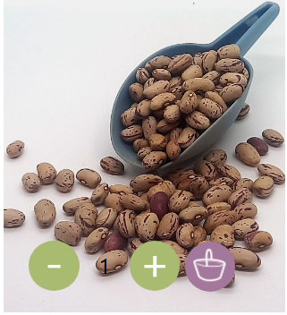
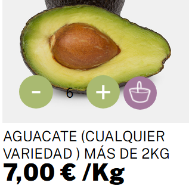
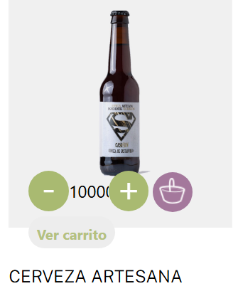
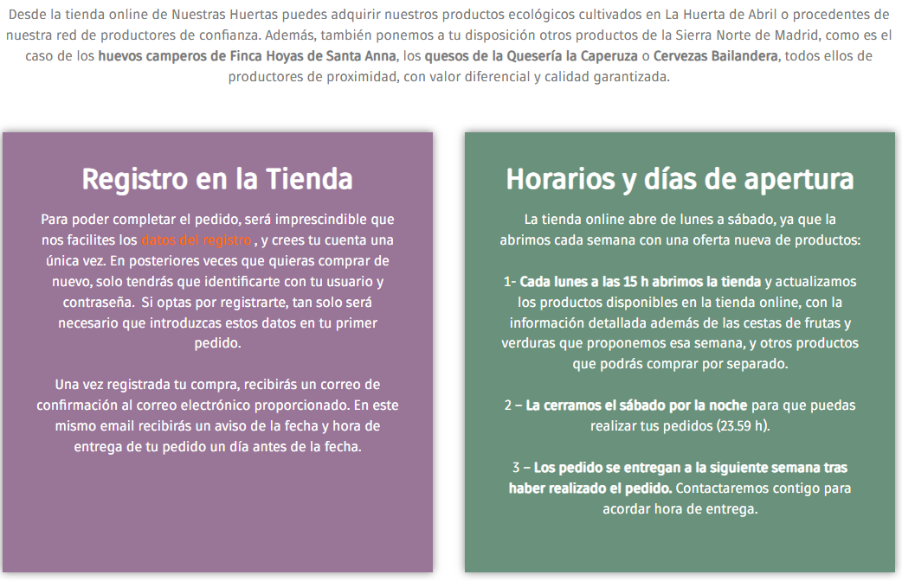
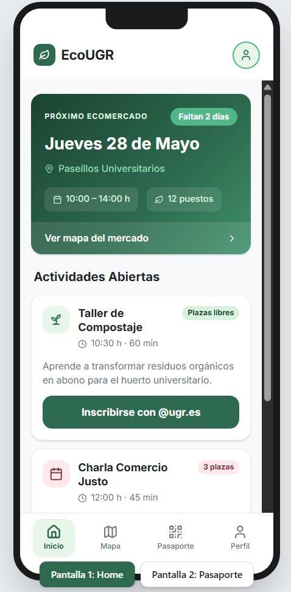
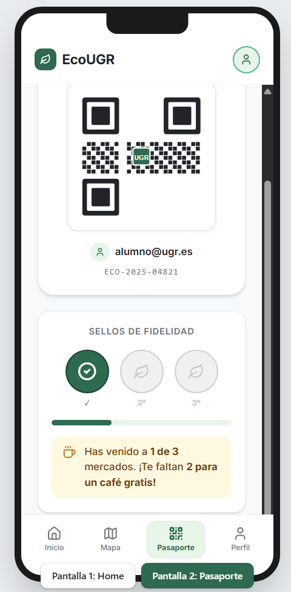

# PARTE II: Caso de Estudio - Propuesta de Diseño ECO MERCADO UGR

## 1. Caso seleccionado

**Nuestras Huertas** (Bustarviejo, Madrid - `nuestrashuertas.com`).

---

## 2. Análisis de "Nuestras Huertas"

### 2.1. Usabilidad y Arquitectura de la Información (Heurísticas de Nielsen)

El ecosistema digital de *Nuestras Huertas* divide su catálogo en secciones lógicas ("La Huerta", "Nosotros y Productores", "Cómo comprar"), pero presenta errores graves respecto a flujo de información.

| Heurística Incumplida | Descripción del Problema | Evidencia Visual | Nivel de Gravedad (1-4) |
| :--- | :--- | :--- | :---: |
| #1 Visibilidad del estado del sistema | Al añadir un producto al carrito desde la lista, el icono de carga es muy sutil y no hay un mensaje claro de confirmación. Además, los números de cantidad son poco visibles. |  | 4 |
| #4 Consistencia y estándares | Algunos productos se venden por "Unidad" y otros por "Peso", pero la interfaz de los botones `+` y `-` es idéntica, lo que confunde sobre qué se está sumando. |  | 2 |
| #5 Prevención de errores |  No hay advertencias si se intenta comprar una cantidad de producto que excede el stock habitual antes de ir al carrito. |  | 2 |
| #8 Diseño estético y minimalista | La sobrecarga de texto y reducido tamaño de este, dificulta el escaneo rápido de la información.|  | 3 |

### 2.2. Diseño Visual y Accesibilidad (WCAG)

| Criterio Evaluado | Estado | Herramienta de Diagnóstico | Observaciones y Fricciones |
| :--- | :---: | :--- | :--- |
| **Contraste de color (Texto/Fondo)** | Regular | Extensión WAVE | Algunos textos secundarios sobre fondos claros no alcanzan el ratio mínimo. |
| **Jerarquía de Encabezados (H1, H2)** | Falla | Extensión WAVE | Saltos en la jerarquía lógica de etiquetas que dificulta la lectura con lectores de pantalla. |
| **Tamaño de Touch Targets (Móvil)** | Falla | Chrome DevTools | Los selectores de paginación y de cantidad son demasiado pequeños para interacción táctil fluida. |
| **Navegación por Teclado** | Cumple | Test manual (Tecla TAB) | Es posible navegar por los productos usando el tabulador, el foco es visible. |

### 2.3. Análisis de Flujo de Interacción (User Journey de Compra)

**Objetivo de la tarea:** Localizar "Cebollas", añadir 2 Kg al carrito y proceder a la pantalla de pago.

| Paso | Acción del Usuario | Reacción del Sistema | Fricción Detectada (Pain Point) |
| :---: | :--- | :--- | :--- |
| 1 | Uso de la barra de búsqueda superior. | Muestra sugerencias en tiempo real. | Ninguna, funcionamiento correcto. |
| 2 | Clic en el botón `+` para añadir cantidad. | Aumenta el número en el *input*. | La web no aclara si el "1" significa 1 Kg, 1 Malla o 1 Unidad hasta leer la descripción detallada. |
| 3 | Clic en "Añadir al carrito". | Breve recarga y agregación de texto ver carrito. | Falta de *feedback* inmersivo; el usuario no tiene claro si la acción tuvo éxito si no mira el carrito. |
| 4 | Ir al Checkout (Pago). | Pantalla de resumen de pedido. | Formulario excesivamente largo; pide datos de facturación antes de asegurar la disponibilidad de envío a la zona. |

### 2.4. Adaptación a Dispositivos (Mobile First / Responsive)

La plataforma muestra deficiencias en el diseño táctil (*Touch Targets*). Los selectores de cantidad (`+` y `-`) son demasiado pequeños para el estándar recomendado, lo que provoca *misclicks* recurrentes (pulsar el enlace del producto en lugar de añadir cantidad).

---

## 3. Insights y Propuesta de Valor: ECO MERCADO UGR

A partir de la auditoría anterior y la lectura del contexto del Eco Mercado UGR, se extraen los siguientes *insights* accionables:

1. **Insight de Confianza:** El usuario universitario/PDI está concienciado, pero tiene poco tiempo. Necesita transparencia absoluta en el precio (así como un cálculo ágil de este) y el origen del producto sin tener que investigar.
2. **Insight Logístico:** El entorno digital genera ansiedad. Es preferible estandarizar formatos, disminuir texto, aumentar tamaño de letra y distinguir elementos importantes para agilizar la toma de decisiones. También es importante tener una buena jerarquía y navegación.

### Propuesta de Valor (Value Proposition)

"EcoUGR App: Tu programa interactivo y tarjeta de fidelidad para el Ecomercado."

En lugar de crear un e-commerce complejo (que requeriría logística de envíos y pasarelas de pago), la propuesta consiste en una WebApp ligera enfocada en la información y la fidelización. Su objetivo realizable es agrupar toda la información dispersa del evento en un solo lugar y premiar a los estudiantes/profesores que asisten presencialmente.

---

## 4. Planteamiento de la Propuesta de Diseño (Objetivos Realistas y UX)

El diseño se centrará en tres funcionalidades básicas y viables a nivel de programación, justificadas bajo las leyes de usabilidad:

### Objetivo 1: El Mapa y Directorio Visual

**¿Qué hace?** Muestra un mapa simple de los Paseíllos Universitarios con los puestos numerados. Al pulsar un número, aparece quién es el productor (ej. "Huerta de la Vega") y qué vende hoy (ej. "Verduras, Quesos, Miel").

* **Justificación UX (Heurística #1 de Nielsen - Visibilidad del estado del sistema):** El usuario ya no llega "a ver qué hay". Sabe de antemano si el productor que busca ha montado su puesto ese día. Se elimina la frustración de hacer el viaje en vano, mejorando la retención de usuarios.

### Objetivo 2: Reserva de Actividades en 1 Clic

**¿Qué hace?** El Ecomercado tiene talleres (ej. "Taller de compostaje"). La app muestra la agenda y permite reservar plaza pulsando un solo botón, utilizando el inicio de sesión único (SSO) de la universidad (`@ugr.es`).

* **Justificación UX:** Se elimina el clásico y tedioso formulario de Google Forms. A diferencia del inmenso formulario que vimos en el ejemplo evaluado; al usar la cuenta de la UGR, los datos (nombre y correo) ya están validados. El usuario solo pulsa un botón grande en su pantalla. A menos opciones y pasos, mayor es la inscripción a la actividad.

### Objetivo Realista 3: Tarjeta de Fidelización Digital mediante QR (Gamificación básica)

**¿Qué hace?** Para incentivar que los estudiantes vayan al mercado físico, la app incluye un código QR personal. Al comprar algo en cualquier puesto, el productor escanea el QR. Si el estudiante acumula 3 compras en el mes, la UGR le regala una bolsa de tela reutilizable o un café en la cafetería de su facultad.

* **Justificación UX (Heurística #2 - Relación con el mundo real):** Digitalizamos un modelo mental que todos los usuarios ya comprenden y saben usar. Esto crea un bucle de enganche positivo sin necesidad de desarrollar un sistema complejo de puntos.

### 4.1. Accesibilidad y Entorno de Uso

Dado que esta app se utilizará físicamente caminando por los Paseíllos Universitarios (exteriores, a plena luz del día y con prisas):

* **Contraste y eficiencia:** El diseño será de **alto contraste**, utilizando fondos claros y tipografía gruesa. Se evitará la sobrecarga de imágenes pesadas, asegurando que la WebApp cargue en menos de 3 segundos incluso con los datos móviles lentos que suele haber en aglomeraciones dentro del campus.

---

## 5. Mockups: Propuesta Visual (EcoUGR App)

Se ha desarrollado un prototipo estático para ilustrar la propuesta de valor de la **EcoUGR App**. El diseño se ha modelizado siguiendo el diseño *Mobile-First*, garantizando una interfaz facil de navegar y altamente orientada a la acción en móvil. Se aplican las pautas descritas en la sección anterior (botones accesibles, alto contraste y modelos mentales reconocibles):

### 5.1. Pantalla Principal (Dashboard y Actividades)

La pantalla no abruma con catálogos interminables. Centraliza la atención en el próximo evento y limita las opciones a las actividades del día.
* **Accesibilidad Táctil:** Los botones de "Inscribirse con @ugr.es" están diseñados como *Touch Targets* masivos de ancho completo. Al estar situados en las propias tarjetas, se reduce el tiempo de apuntado y se minimizan los errores táctiles.
* **Visibilidad del Sistema:** La cabecera ubica al usuario temporalmente (cuenta atrás para el próximo mercado), eliminando la necesidad de buscar fechas en webs externas.

### 5.2. Pantalla de Fidelización (Pasaporte Ético)

El diseño emula la clásica tarjeta para sellar (con 3 círculos de progreso). Se digitaliza un modelo mental universal, por lo que el usuario entiende su funcionamiento sin curva de aprendizaje.
* **Diseño Estético y Minimalista:** Al usarse esta pantalla físicamente, se han eliminado todos los elementos secundarios. El QR domina el centro con amplios márgenes blancos para garantizar un escaneo rápido.
* **Contraste y Legibilidad:** Los textos motivacionales y el progreso ("Te faltan 2 para un café gratis") emplean tipografía gruesa y un alto contraste sobre fondo claro, asegurando su legibilidad en el exterior de los Paseíllos Universitarios bajo la luz solar.

---

## 6. Análisis Final y Autoevaluación: De la Práctica al Mundo Real

La elaboración de esta propuesta para el Ecomercado UGR me ha servido como un ejercicio de reflexión y validación de las competencias adquiridas durante la asignatura.

### 6.1. Caso de estudio

Visualmente hablando, me he centrado en la simplificación de opciones y la creación de botones masivos para una fácil interacción. Además, he replicado el rigor en el diseño visual aprendido en Figma, estructurando la información, utilizando jerarquías tipográficas y asegurando el contraste de color (WCAG).

### 6.2. Lo que ha faltado en este caso

El principal déficit de esta propuesta para el EcoUGR es la **ausencia de validación empírica**.
En las prácticas de la asignatura, aprendí que ningún diseño es válido hasta que se testea con usuarios reales. Este caso de estudio se ha quedado en la fase de ideación y evaluación heurística.
Para que el caso EcoUGR fuera un proyecto real completo, faltaría rrealizar evaluaciones con estudiantes reales utilizando el prototipo de Figma en un móvil.

### 6.3. Conclusión

A modo de autoevaluación, considero que mi nivel de preparación para afrontar el diseño de un producto digital en un entorno real es sólido. La evolución es evidente: he pasado de justificar mis diseños con argumentos subjetivos a defender decisiones basadas en leyes psicológicas (modelos mentales), normativas de accesibilidad (WCAG) y métricas cuantitativas.

Aunque todavía necesito perfeccionar la ejecución técnica, comprendo el ciclo de vida iterativo del Diseño Centrado en el Usuario. Entiendo que debo resolver problemas de comunicación entre el sistema y el humano, minimizando la confusión y aportando un valor tangible al modelo de negocio o, como en este caso, a una iniciativa comunitaria y ecológica.
